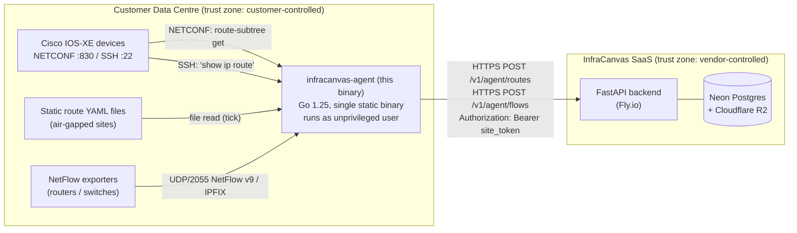

# Architecture

## System Diagram

The diagram shows three distinct trust zones (customer DC, in-flight
HTTPS, vendor SaaS) and the single direction of cloud traffic (agent
to backend, never reverse). The agent dials devices and the backend;
nothing dials the agent except operator-controlled NetFlow exporters
on the management VLAN.

## Component map

| Component | Path inside binary | Purpose |
|-----------|--------------------|---------|
| CLI entry | `cmd/infracanvas-agent/main.go` | cobra root command + `run` daemon + `version` subcommand |
| Config loader | `internal/config/` | `agent.yaml` parser + static route file parser |
| NETCONF collector | `internal/netconf/` | `nemith.io/netconf` SSH transport, route subtree filter, GET-only |
| SSH collector | `internal/ssh/` | `golang.org/x/crypto/ssh`, PTY + `terminal length 0`, `show ip route` |
| NetFlow listener | `internal/netflow/` | UDP listener on port 2055, `goflow2/v2` decoder, in-memory ring buffer |
| Push client | `internal/push/` | `net/http` POST, Bearer-token auth, retry-twice-then-drop |

All packages are private (`internal/`) — they are not importable from
outside the agent module. There is no plugin or dynamic-loading model.

## Process model

- Single OS process. No `fork(2)` or `exec(2)`.
- One goroutine per ticker (5-min routes / 1-min BGP-noop / 30-s NetFlow
  flush).
- One goroutine for the NetFlow UDP read loop.
- Graceful shutdown on SIGINT / SIGTERM via `signal.NotifyContext`; a
  `sync.WaitGroup` gates exit until in-flight tick goroutines have
  drained.
- Recommended deployment as an unprivileged, sandboxed `systemd` service
  (see [operator-runbook.md](./operator-runbook.md) Step 5).

## Network footprint

| Direction | Port/Proto | Peer | Purpose |
|-----------|-----------|------|---------|
| Outbound  | 830/tcp   | NETCONF-enabled devices (operator's DC) | Route collection |
| Outbound  | 22/tcp    | SSH-only devices (operator's DC) | Route collection |
| Inbound   | 2055/udp  | NetFlow exporters (operator's DC, optional) | Flow ingestion |
| Outbound  | 443/tcp   | `api.infracanvas.dev` (single hostname) | Push (HTTPS) |

No other listeners. No other dialers. The agent does not perform DNS
queries except those issued by the OS resolver to reach
`api.infracanvas.dev` and the configured device hostnames in
`agent.yaml`.

> **Hardening note:** the NetFlow UDP listener defaults to `:2055`
> (all interfaces). Operators are encouraged to bind the listener to a
> management-VLAN interface or to the loopback (with port-forwarded
> exporters) when the host is multi-homed. See
> [known-limitations.md](./known-limitations.md) L-4 for residual risk.

## Dependency footprint

Go module: `github.com/infracanvas/infracanvas/agent`, Go 1.25.

Direct dependencies (locked versions in `agent/go.mod`):

| Module | Version | Purpose |
|--------|---------|---------|
| `nemith.io/netconf` | v0.0.4 | NETCONF RFC 6241/6242 client |
| `golang.org/x/crypto` | v0.50.0 | SSH client transport |
| `github.com/netsampler/goflow2/v2` | v2.2.6 | NetFlow v9 / IPFIX decoder |
| `github.com/spf13/cobra` | v1.10.2 | CLI framework |
| `gopkg.in/yaml.v3` | v3.0.1 | YAML parser |
| `go.uber.org/zap` | v1.28.0 | structured logger |
| `github.com/stretchr/testify` | v1.11.1 | test deps (NOT in production binary) |

The full transitive closure with hashes and license evidence is in
[sbom.cyclonedx.json](./sbom.cyclonedx.json).

## Build and distribution

- **Toolchain:** Go 1.25, `CGO_ENABLED=0` (statically linked), built in
  GitHub Actions on `ubuntu-latest` and `macos-latest` runners.
- **Targets:** `linux/amd64` and `darwin/arm64` (Phase 10 scope).
- **Distribution:** GitHub Release artifacts, downloaded over HTTPS.
- **Reproducibility:** `go.sum` is committed; `go mod verify` runs in
  CI and again at release time.
- **Version stamping:** the `version` string is injected at build time
  via `-ldflags="-X main.version=$(git describe --tags)"` and is the
  only source of the value reported by `infracanvas-agent version`.

## Out of scope (Phase 10)

- Dashboard UI for site-token management (deferred to Phase 11+).
- mTLS to the backend (deferred to enterprise tier — see
  [known-limitations.md](./known-limitations.md) L-6).
- Disk-backed NetFlow queue (in-memory ring buffer only — see L-5).
- Asymmetric-path detection / topology computation (Phase 12).
- Firewall integrations (ASA/Checkpoint) (Phase 11+).
