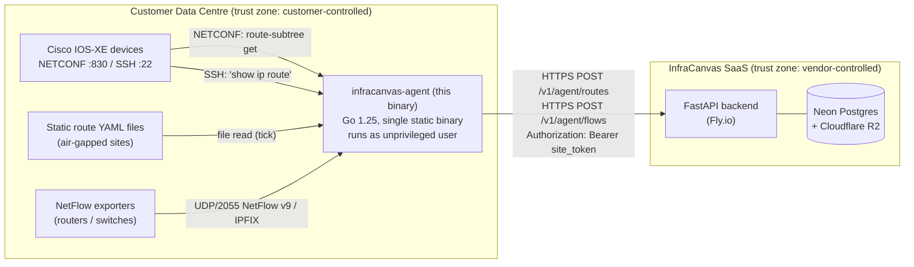
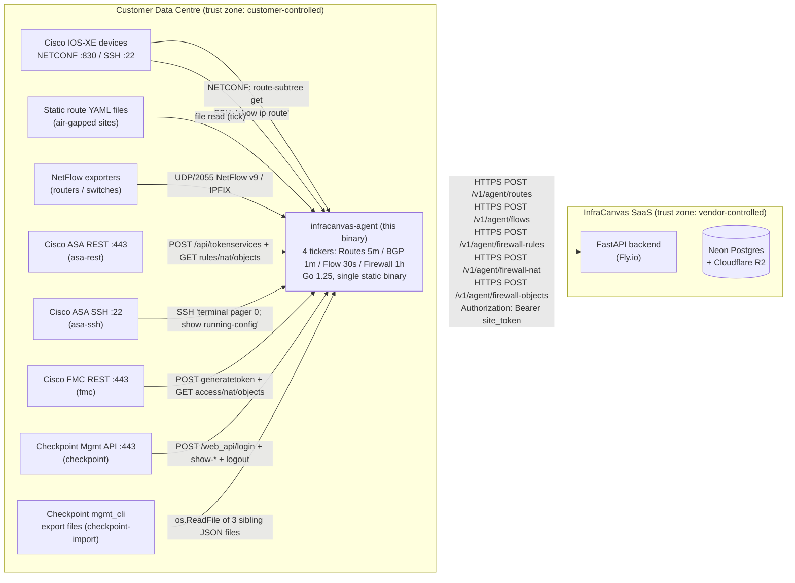

# Architecture

## System Diagram

The diagram shows three distinct trust zones (customer DC, in-flight
HTTPS, vendor SaaS) and the single direction of cloud traffic (agent
to backend, never reverse). The agent dials devices and the backend;
nothing dials the agent except operator-controlled NetFlow exporters
on the management VLAN.

## Component map

| Component | Path inside binary | Purpose |
|-----------|--------------------|---------|
| CLI entry | `cmd/infracanvas-agent/main.go` | cobra root command + `run` daemon + `version` subcommand |
| Config loader | `internal/config/` | `agent.yaml` parser + static route file parser |
| NETCONF collector | `internal/netconf/` | `nemith.io/netconf` SSH transport, route subtree filter, GET-only |
| SSH collector | `internal/ssh/` | `golang.org/x/crypto/ssh`, PTY + `terminal length 0`, `show ip route` |
| NetFlow listener | `internal/netflow/` | UDP listener on port 2055, `goflow2/v2` decoder, in-memory ring buffer |
| Push client | `internal/push/` | `net/http` POST, Bearer-token auth, retry-twice-then-drop |

All packages are private (`internal/`) — they are not importable from
outside the agent module. There is no plugin or dynamic-loading model.

## Process model

- Single OS process. No `fork(2)` or `exec(2)`.
- One goroutine per ticker (5-min routes / 1-min BGP-noop / 30-s NetFlow
  flush).
- One goroutine for the NetFlow UDP read loop.
- Graceful shutdown on SIGINT / SIGTERM via `signal.NotifyContext`; a
  `sync.WaitGroup` gates exit until in-flight tick goroutines have
  drained.
- Recommended deployment as an unprivileged, sandboxed `systemd` service
  (see [operator-runbook.md](./operator-runbook.md) Step 5).

## Network footprint

| Direction | Port/Proto | Peer | Purpose |
|-----------|-----------|------|---------|
| Outbound  | 830/tcp   | NETCONF-enabled devices (operator's DC) | Route collection |
| Outbound  | 22/tcp    | SSH-only devices (operator's DC) | Route collection |
| Inbound   | 2055/udp  | NetFlow exporters (operator's DC, optional) | Flow ingestion |
| Outbound  | 443/tcp   | `api.infracanvas.dev` (single hostname) | Push (HTTPS) |

No other listeners. No other dialers. The agent does not perform DNS
queries except those issued by the OS resolver to reach
`api.infracanvas.dev` and the configured device hostnames in
`agent.yaml`.

> **Hardening note:** the NetFlow UDP listener defaults to `:2055`
> (all interfaces). Operators are encouraged to bind the listener to a
> management-VLAN interface or to the loopback (with port-forwarded
> exporters) when the host is multi-homed. See
> [known-limitations.md](./known-limitations.md) L-4 for residual risk.

## Dependency footprint

Go module: `github.com/infracanvas/infracanvas/agent`, Go 1.25.

Direct dependencies (locked versions in `agent/go.mod`):

| Module | Version | Purpose |
|--------|---------|---------|
| `nemith.io/netconf` | v0.0.4 | NETCONF RFC 6241/6242 client |
| `golang.org/x/crypto` | v0.50.0 | SSH client transport |
| `github.com/netsampler/goflow2/v2` | v2.2.6 | NetFlow v9 / IPFIX decoder |
| `github.com/spf13/cobra` | v1.10.2 | CLI framework |
| `gopkg.in/yaml.v3` | v3.0.1 | YAML parser |
| `go.uber.org/zap` | v1.28.0 | structured logger |
| `github.com/stretchr/testify` | v1.11.1 | test deps (NOT in production binary) |

The full transitive closure with hashes and license evidence is in
[sbom.cyclonedx.json](./sbom.cyclonedx.json).

## Build and distribution

- **Toolchain:** Go 1.25, `CGO_ENABLED=0` (statically linked), built in
  GitHub Actions on `ubuntu-latest` and `macos-latest` runners.
- **Targets:** `linux/amd64` and `darwin/arm64` (Phase 10 scope).
- **Distribution:** GitHub Release artifacts, downloaded over HTTPS.
- **Reproducibility:** `go.sum` is committed; `go mod verify` runs in
  CI and again at release time.
- **Version stamping:** the `version` string is injected at build time
  via `-ldflags="-X main.version=$(git describe --tags)"` and is the
  only source of the value reported by `infracanvas-agent version`.

## Out of scope (Phase 10)

- Dashboard UI for site-token management (deferred to Phase 11+).
- mTLS to the backend (deferred to enterprise tier — see
  [known-limitations.md](./known-limitations.md) L-6).
- Disk-backed NetFlow queue (in-memory ring buffer only — see L-5).
- Asymmetric-path detection / topology computation (Phase 12).
- Firewall integrations (ASA/Checkpoint) — landed in Phase 11; see
  the "Phase 11 — Firewall Integration" section below for the full
  surface delivered in that phase.

---

## Phase 11 — Firewall Integration

Phase 11 extends the agent with **four firewall vendors via five
protocols**, fed by a **4th ticker on 1h cadence** (D-02). Per CONTEXT
D-16 the protocol expansion adds new values to the existing
`devices[]` `protocol:` field — no new top-level `agent.yaml` field is
added, no new `Device` struct field is introduced.

### Protocols and Collectors

| Protocol value | Collector package / type | Auth | Vendor / Requirement |
|---|---|---|---|
| `asa-rest` | `agent/internal/asa.RESTCollector` | `POST /api/tokenservices` → `X-Auth-Token` | Cisco ASA REST API / ASA-01 |
| `asa-ssh` | `agent/internal/asa.SSHCollector` | SSH password; `terminal pager 0` + `show running-config` | Cisco ASA SSH fallback / ASA-03 |
| `fmc` | `agent/internal/fmc.Client` | `POST /api/fmc_platform/v1/auth/generatetoken` → `X-auth-access-token` + refresh | Cisco FMC / ASA-02 |
| `checkpoint` | `agent/internal/checkpoint.LiveCollector` | `POST /web_api/login` → `X-chkp-sid`; logout per-pull | Checkpoint Management API / CKP-01 |
| `checkpoint-import` | `agent/internal/checkpoint.LoadImport` | (file read — no network) | Checkpoint offline `mgmt_cli` export / CKP-02 |

All five collectors enforce **caller-passes-primitives** (Pattern H —
no `config.Device` reference in the collector signature) and the
**read-only command list is hardcoded** (see the
[threat-model.md](./threat-model.md) "Phase 11 — Firewall Management
Credential Storage" section for the structural proof).

### Updated System Diagram

The Phase 11 additions are strictly **outbound, agent-initiated, and
TLS-encrypted on the cloud side**. The five firewall-mgmt-plane peers
are reached over their existing operator-managed channels (HTTPS for
ASA REST / FMC / Checkpoint live; SSH for ASA SSH; local-filesystem
read for checkpoint-import). Cloud direction remains one-way (agent →
backend) and routes via three new POST endpoints alongside the Phase
10 `/v1/agent/routes` and `/v1/agent/flows`.

### Firewall Data Flow

1. **Ticker fires.** The 4th ticker (`Intervals.Firewall = 1*time.Hour`,
   `agent/cmd/infracanvas-agent/main.go`) fires; the case
   `<-firewallT.C` spawns a `wg.Add(1) / defer wg.Done()`-guarded
   goroutine calling `collectAndPushFirewall(ctx, cfg, pusher, log)`.
2. **Dispatcher selects collector.** For each device whose protocol is
   one of the 5 firewall protocols, `firewallCollectorFor(dev)`
   returns the closure that calls the vendor `Pull` method. Non-firewall
   protocols return `nil` from the dispatcher and are silently skipped
   (they are handled by `collectAndPushRoutes` on the routes ticker).
3. **Snapshot ID minted ONCE.** Before any push call, the dispatcher
   mints a single `uuid.NewString()` `snapshot_id` per device per tick
   (RESEARCH Pattern 2). This UUIDv4 is threaded through all three
   push payloads.
4. **Collector pulls rules + NAT + objects.** The vendor collector
   returns three slices: `[]push.FirewallRule`, `[]push.FirewallNATRule`,
   `[]push.FirewallObject` — vendor responses normalized to the D-08
   hybrid shape (normalized columns + `raw_blob` JSONB).
5. **Agent fans out three POSTs.** All three carry the same
   `snapshot_id`, `firewall_id`, `vendor`, `source`, `snapshot_ts`
   envelope:
   - `POST /v1/agent/firewall-rules`
   - `POST /v1/agent/firewall-nat`
   - `POST /v1/agent/firewall-objects`
6. **Backend persists idempotently.** Each handler runs `INSERT ... ON
   CONFLICT (snapshot_id) DO NOTHING` on the parent
   `firewall_ruleset_snapshots` row, then bulk-inserts children at 500
   rows per `executemany`. The three handlers are independent and
   idempotent regardless of arrival order or repetition (RESEARCH
   Pattern 2 — the snapshot_id is the keystone).

### Storage Model (Backend)

**Hybrid normalized + raw_blob** (D-08). Each `firewall_rules` row
carries both vendor-agnostic columns (`src_zone`, `dst_zone`,
`src_cidr`, `dst_cidr`, `action`, `protocol`, `ports`, `position`) and
a JSONB `raw_blob` preserving the vendor-native rule envelope.
**Phase 12 path computation reads the normalized columns; vendor-
specific UI / audit consumers read `raw_blob`.** The same hybrid
applies to `firewall_nat_rules` (translation columns + `raw_blob`)
and `firewall_objects` (`kind` / `name` / `value` + `raw_blob`).

**Snapshot-per-pull (full replace)** (D-10). Each hourly pull writes a
new `firewall_ruleset_snapshots` parent row keyed by the agent-minted
`snapshot_id` with the full rule / NAT / object lists hanging off of
it via FK CASCADE. The `GET /v1/sites/{site_id}/firewall-rules` read
endpoint returns DISTINCT ON `(firewall_id) ORDER BY firewall_id,
snapshot_ts DESC` — latest snapshot per device. TTL pruning at
14 days (default, env-overridable via `FIREWALL_SNAPSHOT_TTL_DAYS`)
holds the storage envelope (RESEARCH Pitfall 7).

**RLS team isolation.** All four tables are
`ENABLE` + `FORCE ROW LEVEL SECURITY`. The parent table policy keys on
`team_id`; child policies key via `snapshot_id IN (SELECT snapshot_id
FROM firewall_ruleset_snapshots WHERE team_id = current_setting(...))`.
Every push handler and the read endpoint set `app.current_team_id`
inside the same transaction (Pattern B).

### Updated Component Map (Phase 11 additions)

| Component | Path inside binary | Purpose |
|-----------|--------------------|---------|
| ASA REST collector | `internal/asa/rest.go` | HTTPS token-cache REST collector for Cisco ASA (9.3(2) – 9.16) |
| ASA SSH collector | `internal/asa/ssh.go` | SSH `show running-config` + `terminal pager 0` collector for any ASA version (required for 9.17+) |
| FMC client | `internal/fmc/client.go` | HTTPS token + refresh client for Cisco FMC; first-domain / first-policy posture (L-11-04) |
| Checkpoint live collector | `internal/checkpoint/live.go` | HTTPS login-per-pull client (`session-timeout: 3600`) for Checkpoint Management API |
| Checkpoint shared parser | `internal/checkpoint/parser.go` | Pure function used by BOTH live + import paths (D-12 architectural lock) |
| Checkpoint import loader | `internal/checkpoint/import.go` | `os.ReadFile` loader for the 3 sibling `mgmt_cli --format json` exports |
| Firewall dispatcher | extends `cmd/infracanvas-agent/main.go` | `collectAndPushFirewall` + `firewallCollectorFor` (5-way protocol switch); mints shared `snapshot_id` per device per tick |
| Push client extensions | extends `internal/push/client.go` | `PushFirewallRules` / `PushFirewallNAT` / `PushFirewallObjects` (3 methods, all reuse `postWithRetry`) |

### Updated Process Model

- One additional goroutine per ticker tick — `collectAndPushFirewall`
  (1h cadence). Goroutine pile-up is implausible at 1h cadence vs.
  sub-minute pull duration (T-11-07-01 acceptance).
- Same `sync.WaitGroup` shutdown drain — the 4th ticker case is
  `wg.Add(1) / defer wg.Done()`-guarded just like Routes / BGP / Flow.
  `TestRunDaemon_FirewallTick` regression-tests shutdown under a 2s
  timeout (T-11-07-02 mitigation).

### Updated Network Footprint

| Direction | Port/Proto | Peer | Purpose |
|-----------|-----------|------|---------|
| Outbound  | 443/tcp   | Cisco ASA REST (operator's DC) | Firewall rule-base collection (`asa-rest`) |
| Outbound  | 22/tcp    | Cisco ASA SSH (operator's DC) | Firewall rule-base collection via `show running-config` (`asa-ssh`) |
| Outbound  | 443/tcp   | Cisco FMC (operator's DC) | Firewall rule-base collection (`fmc`) |
| Outbound  | 443/tcp   | Checkpoint Mgmt server (operator's DC) | Firewall rule-base collection (`checkpoint`); login + show + logout per pull |
| (none — file) | n/a   | local filesystem | `checkpoint-import` reads 3 sibling JSON files on the agent host |

No new inbound listeners. No new dialers beyond the four firewall
mgmt-plane peers per configured device. The 443/tcp egress to
`api.infracanvas.dev` (Phase 10) carries the three additional
firewall push endpoints — same hostname, same TLS chain.

### Dependency Footprint (Phase 11 deltas)

| Module | Version | Purpose |
|--------|---------|---------|
| `github.com/google/uuid` | v1.6.0 | UUIDv4 minting for the shared `snapshot_id` (RESEARCH Pattern 2) |

No other new runtime dependencies. ASA REST / FMC / Checkpoint live
use `net/http` from the Go stdlib; ASA SSH reuses `golang.org/x/crypto`
(Phase 10); `checkpoint-import` reuses `encoding/json` from the stdlib.

### Build and Distribution (Phase 11 deltas)

No change. Same Go 1.25 + `CGO_ENABLED=0` + cross-compile to
`linux/amd64` and `darwin/arm64`. Phase 11 adds source files to the
existing module; no new artifacts, no new toolchain dependencies, no
release-workflow change.
